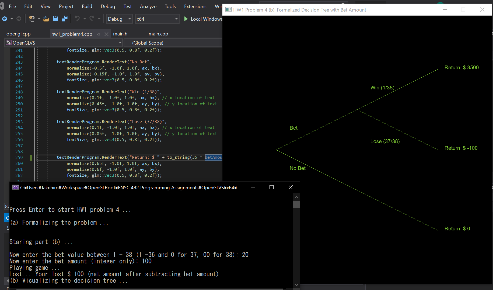
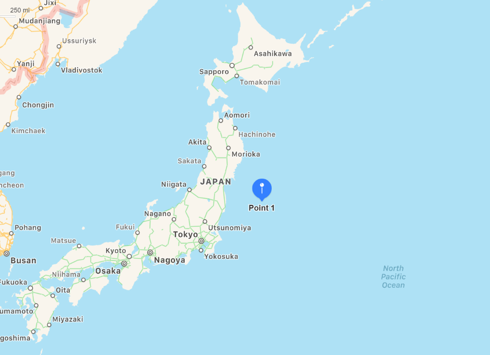
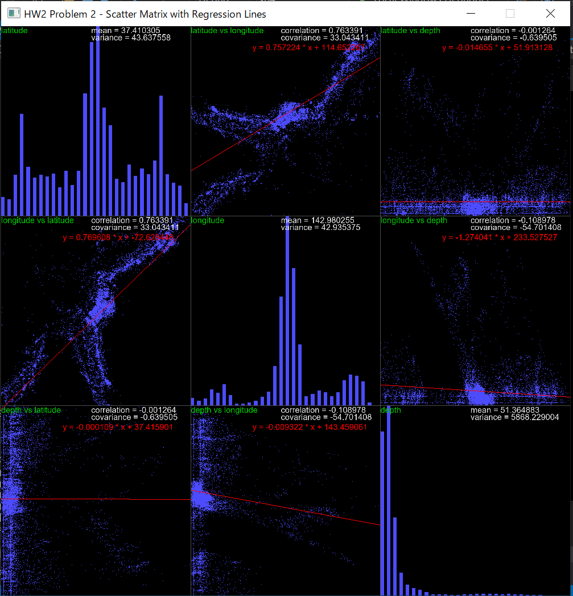

# HW Discussion and Results

   

### HW1
**Problem 1**

Three basic graphic model shown below.

**Problem 2**

Example 1 shown below.
Also, example 2 stack that has 4 different user input R values before sort is shown.

After sort, you have this.

**Problem 3**

**Problem 4**

The problem is formalized in the following decison matrix.

The decision tree that depends on the user choice of value and bet amount will be follows. In this case, the bet amount is $100 for
choosing value 20.

**Problem 5**

**Problem 6**

### HW2
**Problem 1**
Overlay 1D gaussian distribution on the histogram for the two datasets latitude and longitude are shown below.
We set the number of bin to **30** and used the entire data samples **14092** points. The data is taken from 2001-01-02 to 2018-11-27 for 18 years.

For the result for dataset latitude, the histogram is following the gaussian shape and the mean value of latitude is approximately the highest frequency of the histogram and is **37.41 degree**.
Similarly for the longitude dataset, the mean value (approximately highest frequency) is **142.98 degree**.
For the location (latitude, longitude) = (37.41, 142.98) is shown below from online [https://getlatlong.net/](https://getlatlong.net/).

This shows that the location near the north east of tokyo has higher probability of earthquake to occur based on the 18 years of data.

Computing the Bhatacharrya Coefficient, we got **0.915415**. This value is close to 1, indicating that the two datasets of latitude and longitude is similar in shape.

In case, I will also show the result of 3rd variable as following.

**Problem 2**

Continuing from the problem 1, I defind the 3 variables as:

- Latitude (variable 1)
- Longitude (variable 2)
- Depth (variable 3)

Input dataset is attached in the same project directory OpenGLVS.
The scatter matrix from the 3 variables are shown below. Note that my program can input any number of variables, so 
it can be n by n scatter matrix.

As you can see that the scatter plot between the data 1 (latitude) and data 2 (longitude) are showng some strength
on the straight line with a positive direction. This is also shown in the correlation value
between data 1 and data 2, showing high value of correlation.

On the other hand, as for the case for the data 1/data 2 (latitude/longitude) and data 3 (depth) are showing very weak
strength of straightline as also can be shown in the low correlation value.

This concludes that latitude and longitude of earthquake that occurs closely related (which is obvious since
 both information represents the geographical information), but the there seems no relation between the 
geographical informatoion (latitude or longitude) and the depth.

**Problem 3**
Using the Least-Squares Regression Lines method (1st order), the regression is layed on the scatter matrix as shown below.

Looking at the slope of plot 1-2, plot 1-3, and plot 2-3, the slope value in plot 1-2 (latitude vs longitude) shows
stronger linearity since the value is closer to 1 while slope values in plot 1-3 is very low (approximiately flat).
plot 2-3 (longitude vs depth) shows slope of -1.27, which could be caused by the very different scale of each variable
 that causes the unstable slope value. The scale of depth is [0, 683.359] while the scale of longitude is [124.29, 158.82].
 The scale of depth (y axis) is much larger than the longitude (x axis), so the slope fluctuate a lot in the vertical direction, 
causing the slope to be deviate from 0.

**Problem 4**

The result of the image shown below as an example choosing the MBC location which is node number 5.

**Problem 5**

### HW3

**Problem 1**

I used the same dataset from the hw2 and utilized k-means clustering to perform clutsering of 3 clusters.
My program works in any number of clusters, so I can even cluster more than 3 clusters. Also, my program was able animate the every iteration, so you can test by running the program.
Note that I have chosen the fixed iteration as 1000 and step size as 1.
The following example is the 50 samples case between latitude and longitude data. 

Similarly for the 14092 samples case, you will get the following.

As you can see that the k-means clustering works fearly well for any number of samples. 

**Problem 2**

For the problem2, I performed a classification drawing the decision boundary using a perceptron algorithm that utilizes the reward and punishment concept.
I tested my program with the lecture example and was able to get the weight coefficient correct as w0 = -2, w1 = 0, w2 = 1.

Now I test on my own dataset using the 50 sample case and the result is as follows. 
As you can see that I was able to classify fairly well on the 50 sample case.

However, if I test on the 14092 samples, it didn't really work well. 
I conclude that the perceptron algorithm that utilizes the Reward-Punishment concept is not accurate in a large number of samples.
This could be because each cluster is too close to each other and it was difficult to draw a decision boundary utilizing the Reward-Punishment concept alone,
so it will need a better approach.

**Problem 3**

My idea is that perform calculation of:

Error Percentage = averageOfEachCluster( abs (# of classified points - # of cluster points) / # of cluster points * 100 )

Or using the confusion matrix, which will require further study.